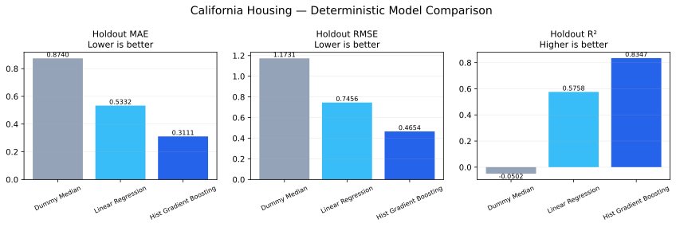
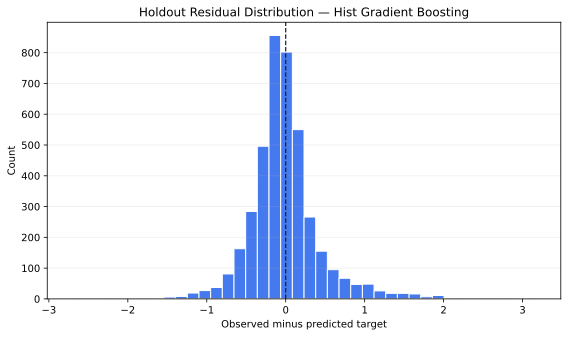

# Regression Model Benchmark

An **independent portfolio benchmark** comparing a transparent baseline, a linear model, and a nonlinear model on the public California Housing dataset. The project emphasizes leakage control, reproducibility, and evidence-backed model comparison rather than a hand-picked headline score.

## Verified results

Dataset: 20,640 records × 8 features. The workflow uses an **80/20** holdout split with **random seed 42**. Five-fold cross-validation runs only on the training split.

| Model | CV MAE mean | CV MAE std | Holdout MAE | Holdout RMSE | Holdout R² |
|---|---:|---:|---:|---:|---:|
| Median baseline | 0.8860 | 0.0092 | 0.8740 | 1.1731 | -0.0502 |
| Linear regression | 0.5291 | 0.0094 | 0.5332 | 0.7456 | 0.5758 |
| Histogram gradient boosting | 0.3165 | 0.0073 | **0.3111** | **0.4654** | **0.8347** |

Histogram gradient boosting achieved the smallest holdout MAE in this fixed comparison. The result is reported alongside the baseline, linear model, cross-validation variation, and holdout metrics so the claim remains inspectable.





## Evaluation design

- One fixed 80/20 train/holdout split
- Five-fold shuffled cross-validation on training data only
- Median `DummyRegressor` as a non-learning baseline
- `LinearRegression` as an interpretable linear comparison
- `HistGradientBoostingRegressor` as a nonlinear tree-based comparison
- MAE, RMSE, and R² reported on the untouched holdout set
- Deterministic model and split configuration using random seed 42

## Repository map

- `src/benchmark.py` — split, model definitions, cross-validation, and holdout evaluation
- `scripts/run_benchmark.py` — public data loading, metric export, and SVG generation
- `data/metrics.json` — machine-readable result source
- `artifacts/` — text-based comparison and residual SVGs
- `tests/` — deterministic unit and artifact reconciliation tests
- `METHODOLOGY.md` — exact evaluation contract
- `LIMITATIONS.md` — interpretation boundaries

## Reproduce

```bash
python -m pip install -r requirements.txt
python scripts/run_benchmark.py
python -m pytest tests -v
```

Running the benchmark again with the declared dependency range, dataset version, and seed regenerates `metrics.json` and both SVGs.

## Limitations

This project demonstrates disciplined model evaluation, not production deployment or causal inference. California Housing has known age and representativeness constraints; metrics may change with library or dataset revisions. See `LIMITATIONS.md` for the complete boundary statement.

## License

Original code and documentation are MIT-licensed. The California Housing dataset is fetched through scikit-learn and remains subject to its source terms.

